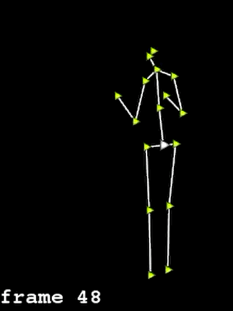

## Multi-View 3D Skeleton Fusion

### Introduction

Python scripts for multi-view 3D skeletons fusion by heatmap-weighted average. 

The 2D heat map for each frame is retrieved from OpenPose/HRnet and is used as confidence for merging corresponding 3D joints from multi-view. 

The oscillation and uncertainty are greatly redeemed by merging multi-view information. 

- **2-view merged output:**

- **More detailed visualization**: Red and green joins are from 2 different views and the white skeleton represents the merged results. 

### Usage
Input:

- Paths of two j3d npy file, each of them is in shape (N, 17, 3), where N is the number of frames.

Output:

- A merged j3d saved in merged.npy in the same folder.
- The shape will be (N, 17, 3)

Run:
`Python mmview-merge.py`
